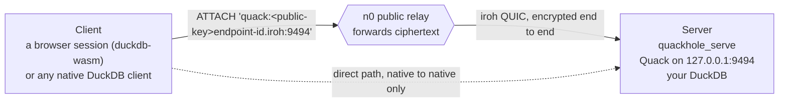

# Quackhole

[](https://github.com/smithclay/quackhole/actions/workflows/MainDistributionPipeline.yml)
[](LICENSE)
[](https://duckdb.org)

You might be running DuckDB on a laptop on home wi-fi, inside a sandbox with no public IP or even inside a browser session. `quackhole` makes it possible to connect to it from anywhere over an encrypted peer-to-peer connection: no open ports or VPN needed. Think of it like "ngrok, but for duckdb and quack"

This project is built on top of [iroh](https://www.iroh.computer/) which does a lot of clever networking and cryptography tricks to punch through firewalled networks. It leverages DuckDB's [new quack protocol](https://duckdb.org/quack/) for application-level duckdb-to-duckdb data transfer.

To get started, you can run this in a browser and connect to a duckdb session running on your laptop or a sandbox.

Just open [smithclay.github.io/quackhole](https://smithclay.github.io/quackhole/) and follow the instructions.

## Architecture



Neither side opens an inbound port. The address *is* the server's ed25519 public key, so there is nothing to resolve and no certificate to issue. Quack is unchanged at both ends; quackhole only carries its bytes.

## Quickstart

[smithclay.github.io/quackhole](https://smithclay.github.io/quackhole/) walks you through an example that connects a remote duckdb session to one running in your browser tab (really!). Otherwise, on the machine you want to reach, behind NAT:

```sql
INSTALL quack; LOAD quack;
-- Not in community-extensions yet: download the binary from the GitHub release
-- and start DuckDB with -unsigned. `npx quackhole` does both for you.
LOAD quackhole;

SELECT ticket FROM quackhole_serve(token := 'your-shared-token');
```

`quackhole_serve` starts Quack on loopback if nothing is listening there, binds an iroh
endpoint, and waits for it to learn a home relay. It returns a ticket: one string carrying
the endpoint id, the relay, and the token. The `url` column wraps that same ticket in a link,
so clicking it opens the browser workbench with the connection underway.

Handle the ticket the way you handle a password. Anyone who reads it can attach and run SQL.
See [Security](#security).

From anywhere else, on another network or another continent:

```sql
INSTALL quack; LOAD quack;
LOAD quackhole;

CALL quackhole_attach('qh1_…', name := 'laptop');

FROM laptop.logs WHERE ts > now() - INTERVAL '1 hour';
```

`quackhole_attach` creates the secret, scopes it to the peer, registers the relay from the
ticket, and runs the `ATTACH`. One call, so you keep no two strings in agreement by hand.
After it you write ordinary Quack SQL.

Each call picks its own role. One DuckDB can serve its own tables and attach three remotes in
the same session, and `name :=` gives each remote its own catalog.

Register the relay. Skip it and iroh resolves the peer through pkarr instead, a round trip to
a third party that has to have seen the peer publish first. A server that started ten seconds
ago may not have published yet, and the dial fails.

With an endpoint id and no ticket, write the long form yourself. Name the secret and scope it
to its peer. DuckDB stores an unnamed quack secret as `__default_quack`, so a second
`CREATE SECRET` collides on the name whatever its scope says.

```sql
CREATE SECRET qh_<endpoint-id> (TYPE quack, TOKEN 'your-shared-token',
                                SCOPE 'quack:<endpoint-id>.iroh:9494');
ATTACH 'quack:<endpoint-id>.iroh:9494' AS laptop;
```

## The address is a public key

```
quack:<endpoint-id>.iroh:9494
```

`<endpoint-id>` is a 32-byte ed25519 public key in z-base-32, which comes to 52 characters
and fits inside a DNS label. No DNS record exists for it and no resolver sees it; Quackhole
intercepts the name before DuckDB opens a socket.

Because the address doubles as the identity, dialing the right address and authenticating the
server are one operation. You involve no certificate authority and renew nothing.

## Uses

- Query a DuckDB behind NAT from anywhere, with no inbound port open on either side.
- Attach several remote DuckDBs at once and join across them.
- Restrict who connects with an `allow` list of endpoint ids, which quackhole checks before
  it passes any Quack traffic.
- Reach one of them from a browser: DuckDB-Wasm attaches to an unmodified `quackhole_serve`. See
  [`web/`](web) for the client, [`npm/`](npm) for it packaged as
  `cdn.jsdelivr.net/npm/quackhole`, or [the demo](https://smithclay.github.io/quackhole/) to
  watch it happen.
- Keep working on networks that block UDP. iroh's relay connection runs over HTTPS/443, so a
  captive portal costs you latency and lets the query through.

## API at a glance

| Function | Behavior |
|---|---|
| `quackhole_serve([token], [target], [allow], [ephemeral], [auto_serve])` | Start Quack on `target` (default `127.0.0.1:9494`) if needed, bind an iroh endpoint, accept streams into it. Returns the ticket and a workbench link |
| `quackhole_attach(ticket, [name])` | Create the secret, scope it, register the relay, and `ATTACH`, for the peer the ticket names. `name` is the catalog it lands under (default `remote`) |
| `quackhole_stop()` | Stop the accept loop. Cached outbound connections stay usable |
| `quackhole_status()` | Endpoint id, relay URL, serving state, and one row per known peer with its path (`direct` or `relay`) |

| Setting | Effect |
|---|---|
| `quackhole_key_path` | Path to the endpoint key (default `~/.quackhole/key`) |
| `quackhole_ephemeral` | Use a throwaway key instead of the persisted one |
| `quackhole_relay_url` | Fallback relay for peers with none registered. A ticket's relay wins over it |
| `quackhole_relays` | Relay servers this endpoint homes on, comma-separated (default: n0's public relays) |

Quackhole reads these when the endpoint binds, which can happen on your first `ATTACH` to a
`.iroh` host, so set them globally:

```sql
SET GLOBAL quackhole_ephemeral = true;
```

Set `quackhole_ephemeral` when you run a client and a server on one machine. Both would load
the same key and share an endpoint id, and iroh refuses that dial with `connecting to ourself
is not supported`. On two machines you can leave it alone.

### Your own relays

By default an endpoint homes on n0's public relays, which is why quackhole needs no
infrastructure. `quackhole_relays` replaces that list with relays you run
([`iroh-relay`](https://github.com/n0-computer/iroh)), so no traffic of yours touches n0's:

```sql
SET GLOBAL quackhole_relays = 'https://relay.example.org./';
FROM quackhole_serve();
```

The relay it picks is the one the ticket carries, so the other side follows without being
configured at all — a client dials whatever relay a ticket names, listed here or not. The
same string is what the browser client takes as its `relays` setting (see [`web/`](web)), and
`npx quackhole --relay <url>` is the demo server's flag for it.

Two things this does not change. Address lookup still publishes to and resolves through n0's
DNS, which the ticket makes unnecessary but does not disable. And a relay that needs an
auth token is not expressible yet.

## Security

The ticket carries the token, so a holder can attach and run SQL. It does not expire, and
Quackhole keeps no revocation list, so cutting off a holder means serving again under a new
token. `quackhole_serve` puts the ticket in a URL fragment to keep it out of access logs and
`Referer` headers; send it over a channel you would send a password over. Pass an `allow`
list if you also want to name the endpoint ids that may connect.

The endpoint key at `~/.quackhole/key` (mode `0600`) encodes the address. Keep the file and
the address survives a restart. Lose it and you get a new address, while your data stays put.

| Property | Enforced by |
|---|---|
| The server is who the address says | iroh, since the endpoint id *is* the TLS identity |
| The relay cannot read or forge traffic | iroh, QUIC/TLS 1.3, end to end |
| Only intended clients connect | quackhole, through the optional `allow` list |
| Only authorized SQL runs | Quack, through its token and auth callbacks |
| Only the Quack port is reachable | quackhole, through a fixed `target` and Quack on loopback |

Relays see endpoint ids, timing, and byte counts. Your SQL, results, tokens, and database
names stay encrypted end to end.

## Limits

Quackhole is early-stage. Over a public relay, across two networks with no route between
them, we measured `ATTACH` at about a second, warm queries at 0.14–0.21s, and a 200k-row scan
under 2.5s.

- **Hole punching is unverified.** Every number above came over a relay. Our test harness
  firewalls the only direct-address candidates, and browsers have no direct path, so we
  cannot tell you how often iroh gets a direct connection through CGNAT or a symmetric NAT.
  Budget for relay latency until you measure your own.
- **Quackhole carries Quack traffic only.** `read_csv('https://<id>.iroh:9494/x.csv')` goes
  to httpfs, which knows nothing about iroh. Reach for `ATTACH` and SQL.
- **Browsers connect as clients over relays**, and need cross-origin isolation (COOP/COEP).
- **An idle `ATTACH` holds a relay path open** at about one packet every five seconds.
  Quackhole caches outbound connections and evicts none of them.
- **Native only**: macOS, Linux, Windows. [`docs/ARCHITECTURE.md`](docs/ARCHITECTURE.md)
  explains why no wasm build exists and what the browser client does instead.

## Documentation

- [Architecture](docs/ARCHITECTURE.md): the seam, and the constraints that shaped it
- [Contributing](CONTRIBUTING.md): build, test, formatting
- [Browser client](web/README.md): the shim, the bridge, and why it cannot be an extension
- [Demo site](site/README.md): the guided page, and cross-origin isolation on GitHub Pages
- [Cross-network test](test/docker/README.md)
- [Deferred work](docs/DEFERRED.md)

## License

MIT. See [LICENSE](LICENSE).
